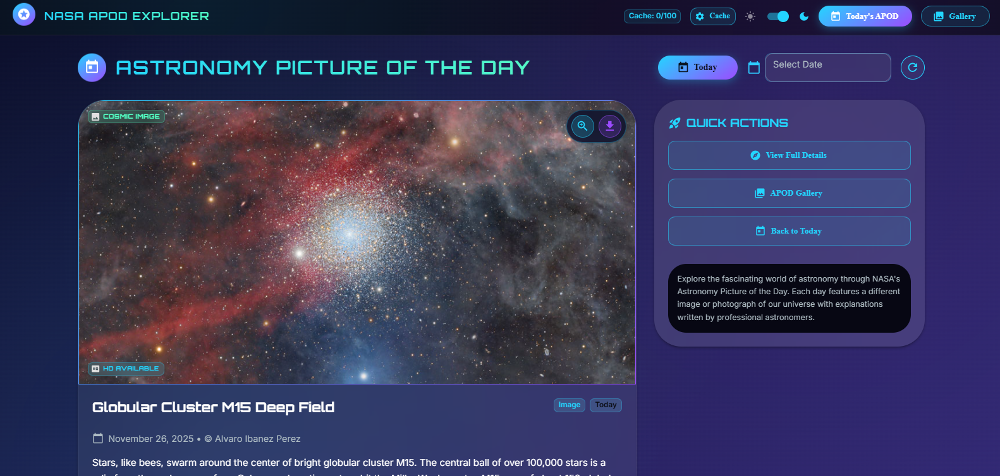

# 🌌 NASA APOD Explorer

A beautiful, responsive web application to explore NASA's Astronomy Picture of the Day with advanced caching and a smooth cosmic UI.

---

## 🔗 Live Links

**Live App:**  
https://nasa-apod-explorer-sepia.vercel.app

**Backend Deployment:**  
https://nasa-apod-explorer-backend.vercel.app

---

## 🖼️ App Preview



---

## 🚀 Features

- 🌠 Daily astronomy pictures from NASA APOD API  
- 🖼️ High-quality image and video support  
- 💾 Smart caching system  
- 🎨 Cosmic-themed responsive UI  
- 📱 Works smoothly on all devices  
- ⚡ Fast performance with Vite  

---

## 🛠️ Tech Stack

**Frontend:** React, Material-UI, Vite  
**Backend:** Node.js, Express, Axios  

---

## 🏃‍♂️ Quick Start

### 📌 Frontend

```bash
cd frontend
npm install
npm run dev
```

### 📌 Backend

```bash
cd frontend
npm install
npm run dev
```


